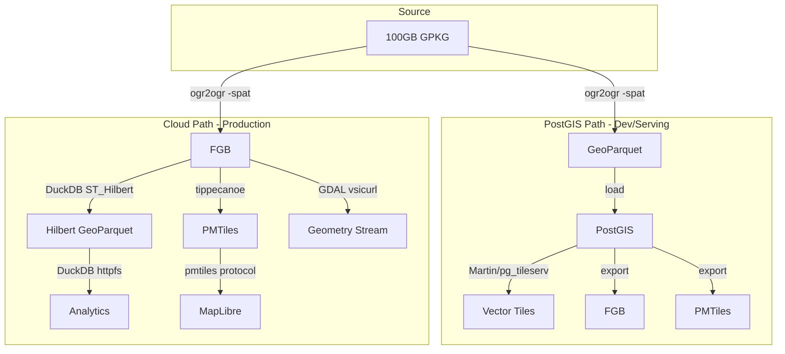

# Next Phases: Cloud-Native Conversion Pipeline

## Current State

- **PostGIS stack**: Fully operational (Martin, pg_tileserv, pg_featureserv, ingest-api, MinIO). Pipeline extracts via `-spat` to GeoParquet, loads to PostGIS, exports to PMTiles/FGB from PostGIS.
- **Gap**: The cloud-native path (FGB intermediate, Hilbert-sorted GeoParquet, PMTiles) is specified in [docs/CLOUD_NATIVE_PIPELINE_SPEC.md](docs/CLOUD_NATIVE_PIPELINE_SPEC.md) but not implemented. Current flow goes through PostGIS; the optimal path derives all three artifacts from a single FGB extract.

## Architecture (Dual Path)

---

## Phase 1: Georgia Validation (Single-State Cloud Pipeline)

**Goal**: Run the full three-artifact cloud pipeline for Georgia and validate each output locally.

### 1.1 FGB-First Extraction

- Add `extract-state-fgb` (or extend `extract-state`) in [scripts/pipeline.ps1](scripts/pipeline.ps1) to output FlatGeoBuf instead of Parquet for the cloud path.
- Use `-spat` with existing `$StateBounds["13"]` (Georgia: -85.61, 30.36, -80.84, 35.00). Do not rely on `-where "state_fips"` — the GPKG column name may differ; bbox is reliable.
- Output: `data/flatgeobuf/GA_parcels.fgb` (or `data/flatgeobuf/state=13/parcels.fgb` for Hive structure).

### 1.2 DuckDB Hilbert GeoParquet Conversion

- Create `scripts/fgb_to_hilbert_parquet.sql` (or `.py` using `uv run --with duckdb`) that:
  - `LOAD spatial;`
  - Reads FGB via `ST_Read('path/to/GA_parcels.fgb')`
  - Orders by `ST_Hilbert(geometry, extent::BOX_2D)` using Georgia bbox
  - Writes to GeoParquet with `COMPRESSION zstd`, `COMPRESSION_LEVEL 3`, `ROW_GROUP_SIZE 50000`
- DuckDB 1.4+ spatial extension supports `ST_Hilbert` and `ST_Read` for FGB. Pixi has `duckdb>=1.4.3`.
- Output: `data/geoparquet/state=13/parcels.parquet` (or flat `GA_parcels.parquet` for Phase 1).

### 1.3 PMTiles from FGB

- **tippecanoe**: Not on conda-forge for Windows. Options:
  - **A) Docker**: Add `tippecanoe` service to compose (e.g. `ghcr.io/jtmiclat/tippecanoe-docker` or `metacollin/tippecanoe`), run via `docker compose run tippecanoe ...`
  - **B) GDAL fallback**: Use `ogr2ogr -f PMTiles` (already in pipeline). GDAL can read FGB and output PMTiles. Lacks `--drop-densest-as-needed`; high-vertex states may need `-simplify` upstream.
- **Recommendation**: Use GDAL for Phase 1 (no new deps, already proven). Add tippecanoe Docker in Phase 3 if tile quality/size becomes an issue.
- Output: `data/pmtiles/state=13/parcels.pmtiles`.

### 1.4 Validation Script

- Create `scripts/validate_cloud_artifacts.ps1` (or Python) that:
  - Runs DuckDB bbox query against the Hilbert parquet (expect sub-second)
  - Verifies PMTiles loads in MapLibre (or fetches a tile via curl)
  - Optionally tests GDAL `read_sf(..., wkt_filter=...)` against FGB
- Document commands in `docs/` or README.

---

## Phase 2: Object Storage and Query Validation

**Goal**: Upload Georgia artifacts to MinIO and confirm DuckDB S3 queries work against Hilbert parquet.

### 2.1 MinIO Upload

- Extend pipeline or add `upload-minio` action that copies `data/geoparquet/state=13/`, `data/flatgeobuf/state=13/`, `data/pmtiles/state=13/` to MinIO `geodata` bucket with Hive-style keys: `geodata/parcels/state=13/parcels.{parquet,fgb,pmtiles}`.
- Use `mc cp` (MinIO client in container) or Python `boto3`/`minio` SDK. The ingest-api or a small script can handle this.

### 2.2 DuckDB S3 Query

- Extend [scripts/query_minio.py](scripts/query_minio.py) to:
  - Query the Hilbert parquet via `read_parquet('s3://geodata/parcels/**/*.parquet', hive_partitioning=true)`
  - Run a bbox filter: `WHERE bbox_min_x <= xmax AND bbox_max_x >= xmin` (or use DuckDB spatial `ST_Intersects` if available)
  - Confirm partition pruning: only the GA file is opened when filtering by `state='13'`.

### 2.3 MapLibre PMTiles from S3

- If MinIO is publicly readable (or via signed URL), test `pmtiles://http://localhost:9000/geodata/parcels/state=13/parcels.pmtiles` in map.html. The `pmtiles` JS library supports HTTP range requests to arbitrary URLs.

---

## Phase 3: National Conversion Loop

**Goal**: Run the cloud pipeline for all states in `$StateBounds`, with optional parallelization.

### 3.1 Unified Cloud Pipeline Script

- Add `cloud-state` and `cloud-full` actions to [scripts/pipeline.ps1](scripts/pipeline.ps1):
  - `cloud-state -State "13" -Name "georgia"`: extract FGB -> Hilbert parquet -> PMTiles (no PostGIS).
  - `cloud-full`: loop over all states in `$StateBounds`, run `cloud-state` for each.
- Output structure: `data/{geoparquet,flatgeobuf,pmtiles}/state={fips}/parcels.{parquet,fgb,pmtiles}`.

### 3.2 Parallelization (Optional)

- Use PowerShell `ForEach-Object -Parallel` (PS 7+) or background jobs to run multiple state extractions concurrently. Limit concurrency (e.g. 4–8) to avoid disk I/O saturation.
- Per-state wall time: ~10–30 min for Georgia-sized state. National: ~6–12 hrs sequential; ~2–4 hrs with 4-way parallel.

### 3.3 tippecanoe for Dense States (Optional)

- For states with very high vertex counts (CA, TX, FL), add tippecanoe Docker service and use it instead of GDAL for PMTiles. `--drop-densest-as-needed` prevents tile overflow. Can be Phase 3.5.

---

## Phase 4: PostGIS Stack Refinements (Lower Priority)

These can run in parallel with Phases 1–3 or after.

### 4.1 TIGER Spatial Indexes

- Add `CREATE INDEX ... USING gist(the_geom)` on `tiger.county`, `tiger.tract` (or equivalent) so Martin can serve them. Currently removed from [config/martin.yaml](config/martin.yaml) due to missing indexes.

### 4.2 Parcel Fill Opacity

- Increase fill opacity in [config/styles/parcels.json](config/styles/parcels.json) so value-based choropleth is visible against OSM basemap. Tune in Maputnik at `:8888`.

### 4.3 dbmate Migrations (Optional)

- Convert [scripts/postgis_schema.sql](scripts/postgis_schema.sql) into dbmate migrations for versioned schema changes. User prefers dbmate for migrations.

---

## File Summary

| New/Modified | Path                                                                          |
| ------------ | ----------------------------------------------------------------------------- |
| New          | `scripts/fgb_to_hilbert_parquet.sql` or `scripts/fgb_to_hilbert_parquet.py`   |
| New          | `scripts/validate_cloud_artifacts.ps1`                                        |
| Modified     | `scripts/pipeline.ps1` — add `extract-state-fgb`, `cloud-state`, `cloud-full` |
| Modified     | `scripts/query_minio.py` — add Hilbert parquet + bbox query                   |
| Optional     | `compose.yml` — add tippecanoe service (Phase 3.5)                            |
| Optional     | `pixi.toml` — add tippecanoe if conda-forge adds win-64 (unlikely)            |

---

## Dependencies

- **DuckDB spatial**: Already in DuckDB 1.4+; `LOAD spatial` at runtime. Pixi has `duckdb>=1.4.3`.
- **tippecanoe**: Use GDAL for Phase 1–3; add Docker image only if tile quality requires it.
- **GPKG extraction**: Use `-spat` (bbox) from `$StateBounds`; do not assume `state_fips` column.

---

## Execution Order

1. **Phase 1** — Implement and validate Georgia cloud pipeline (FGB -> Hilbert parquet -> PMTiles via GDAL).
2. **Phase 2** — Upload to MinIO, validate DuckDB S3 + MapLibre PMTiles.
3. **Phase 3** — Add `cloud-full` loop, run national conversion (weekend job).
4. **Phase 4** — TIGER indexes, style tweaks, dbmate as time permits.

