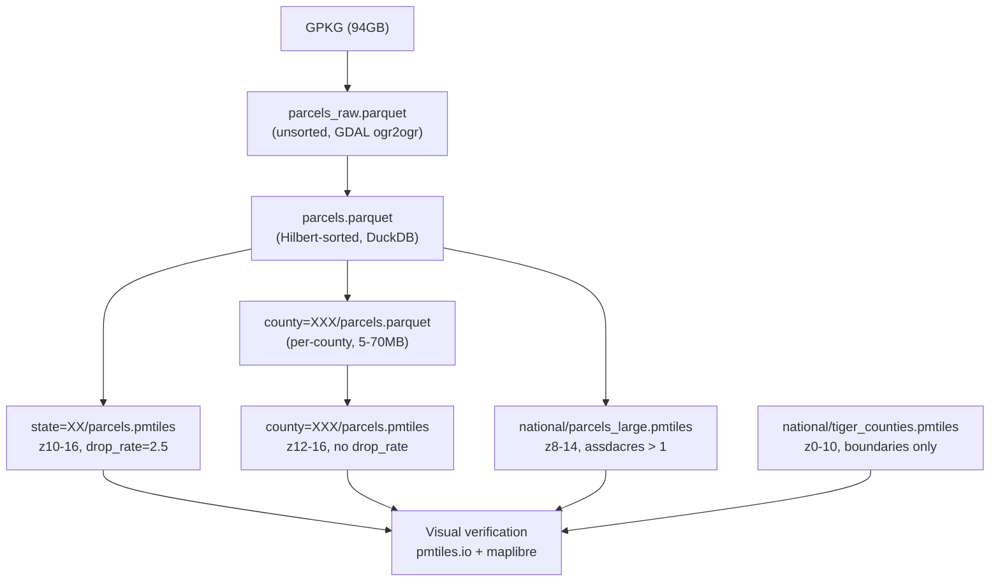

# Parcel Pipeline Validation & Georgia PMTiles Plan

## Execution Strategy

Parallel workstreams are used throughout. Long-running shells (GPKG extraction, PMTiles generation) are backgrounded immediately. Visual verification runs via the browser MCP tool at each step without waiting for the next background job. The sequence:

```
[shell bg] NC Hilbert sort  ──────────────────────────────────────────► NC partition ─► NC county PMTiles
                                                                          ▲
[shell bg] Fulton PMTiles ──► [browser] verify at pmtiles.io ────────────┤
[shell bg] GA state PMTiles ─► [browser] verify z10/z12/z14 ─► tune?    │
[shell bg] GA large-parcel ──► [browser] verify z8/z10 ─► tune?          │
[shell bg] TIGER fetch ──────► [shell bg] TIGER PMTiles                   │
[shell bg] SE state extractions (FL, AL, TN, VA, SC) ─────────────────────┘
[R in bg]  mapgl composition (runs after all artifacts verified)
```

Tools used:
- **Background shells** — GPKG extractions, Hilbert sorts, PMTiles generation (all long-running)
- **Browser MCP** — visual verification on pmtiles.io at each artifact milestone
- **R session (BTW)** — avoided (freezes); `pm_show`/`pm_view`/mapgl run directly via shell `Rscript` commands instead
- **Subagents** — launched for independent parallel tasks (SE state extractions while GA PMTiles experiments run)

## Scope

- **GeoParquet**: SE region first (GA done, NC in progress, then FL/AL/TN/VA/SC). If pipeline is confirmed solid after NC, run full CONUS parquet extractions — getting everything out of the GPKG is the priority since it unlocks all downstream work.
- **PMTiles**: Georgia only for now. Build and validate a complete cartographic GA map (county detail + state overview + large-parcel overview + TIGER context) before touching other states.

## Current State

- **Georgia**: state parquet (1.39GB, 6.96M features) + 159 county parquets — complete and validated
- **North Carolina**: raw parquet complete (1.66GB, 5.76M features) — Hilbert sort **failed** (bug, fixable without re-extracting from GPKG)
- **GDAL Fulton test**: running in background, showing `tile size exceeded` warning — confirms GDAL PMTiles is wrong for dense data; freestiler is the path
- **County=001 PMTiles**: working, verified at z13-15 via pmtiles.io

## Pipeline Architecture



## Step 0 — Fix NC Hilbert Bug (blocker)

**File**: [`scripts/to_hilbert_parquet.py`](scripts/to_hilbert_parquet.py)

**Root cause**: `_detect_geom_col` at line 52-57 looks for `"GEOMETRY"` in the DuckDB type string. GeoArrow-encoded parquet (from `GEOMETRY_ENCODING=GEOARROW`) shows the geometry column as `STRUCT(x DOUBLE, y DOUBLE)[][][]` — no "GEOMETRY" substring.

**Fix**: Fall back to column name matching (`geom`, `geometry`, `shape`) when no GEOMETRY type is found:

```python
def _detect_geom_col(con, table_expr):
    schema = con.execute(f"DESCRIBE SELECT * FROM {table_expr}").fetchall()
    # primary: DuckDB geometry type (from ST_Read / FGB)
    for row in schema:
        if "GEOMETRY" in str(row[1]).upper():
            return row[0]
    # fallback: GeoArrow-encoded parquet — geometry stored as STRUCT,
    # but DuckDB spatial functions (ST_Hilbert etc.) accept it directly
    for row in schema:
        if row[0].lower() in ("geom", "geometry", "shape", "the_geom"):
            return row[0]
    raise ValueError(f"no geometry column found in {table_expr}")
```

After fixing, re-run Hilbert sort on the existing NC raw parquet (no GPKG re-extraction needed):
```powershell
pixi run uv run --with duckdb scripts/to_hilbert_parquet.py `
  data/geoparquet/state=37/parcels_raw.parquet `
  data/geoparquet/state=37/parcels.parquet `
  --state 37
```
Then delete the raw intermediate and partition by county.

## Step 1 — Experiment A: Fulton County PMTiles (urban density baseline)

Generate Fulton (372k features) and visually compare against Appling (29k features, already done):

```r
source("scripts/generate_pmtiles.R")
generate_county_pmtiles("13", "121")  # ~68MB parquet -> county PMTiles
```

**Inspect the archive first** (confirms layer name, zoom range, bounds before viewing):
```r
# install if needed: pak::pak("walkerke/pmtiles")
library(pmtiles)
pm_show("data/pmtiles/state=13/county=121/parcels.pmtiles")
pm_show("data/pmtiles/state=13/county=121/parcels.pmtiles", tilejson = TRUE)
```

**Visual verification — use `pm_view()` which auto-detects correct zoom from tile availability**:
```r
pm_view("data/pmtiles/state=13/county=121/parcels.pmtiles",
        layer_type = "fill",
        fill_color = "#2563eb",
        inspect_features = TRUE)
```
Unlike `freestiler::view_tiles()`, `pm_view()` reads the actual tile zoom range from the PMTiles header and opens at the right zoom automatically. Also verify at z12/z14/z16 by zooming in from the initial view.

**Also cross-check on pmtiles.io via browser** at the coordinate center from `pm_show()` output.

**Pass criteria**: clear parcel boundaries at z13-16, no tile-size warnings, no obvious gaps

## Step 2 — Experiment B: Georgia State PMTiles (drop_rate validation)

```r
generate_state_pmtiles("13")
# min_zoom=10, max_zoom=16, drop_rate=2.5, streaming=always
```

**Inspect then view**:
```r
pm_show("data/pmtiles/state=13/parcels.pmtiles")           # verify zoom range is 10-16
pm_view("data/pmtiles/state=13/parcels.pmtiles",
        layer_type = "fill", inspect_features = TRUE)       # auto-zooms correctly
```

**Visual verification — three zoom levels to check**:

| Zoom | Expected | Pass |
|---|---|---|
| z10 | Sparse parcels visible, coverage indicated | Some parcels showing, not blank, not overwhelming |
| z12 | Readable neighbourhood-scale | Dense but renderable, no tile overflow warnings |
| z14 | Full parcel coverage with clear boundaries | Individual lots clear, geometry intact |

If z10 is blank (too sparse) → retry with `drop_rate=2.0`
If z12 is too dense (slow/crash) → retry with `drop_rate=3.0`

The goal is one visual pass confirming the right value before locking it in for all states.

## Step 3 — Experiment C: Large-Parcel National Layer (size-filter)

Test the size-biased approach on Georgia only first:

```r
freestiler::freestile_query(
  query = "
    SELECT geom, parcelid, statefp, countyfp, usedesc,
           CAST(assdacres AS DOUBLE) AS acres,
           CAST(totalvalue AS BIGINT) AS totalvalue
    FROM read_parquet('data/geoparquet/state=13/parcels.parquet')
    WHERE assdacres IS NOT NULL AND assdacres > 1.0
  ",
  output     = "data/pmtiles/test/ga_large_parcels.pmtiles",
  layer_name = "parcels",
  tile_format = "mlt",
  min_zoom   = 8L,
  max_zoom   = 14L,
  base_zoom  = 14L,
  drop_rate  = 1.5,
  source_crs = "EPSG:4326"
)
```

**Inspect and view**:
```r
pm_show("data/pmtiles/test/ga_large_parcels.pmtiles")
pm_view("data/pmtiles/test/ga_large_parcels.pmtiles",
        layer_type = "fill", inspect_features = TRUE)
```

**Visual verification**:
- z8: Large rural parcels (farms, forests, industrial) scattered across Georgia — not blank
- z10: Denser, bridges toward full coverage before state PMTiles kicks in at z12
- Tune `assdacres` threshold if z8 is blank (→ try `> 0.5`) or too crowded (→ try `> 5.0`)

## Step 4 — TIGER Context Layer

TIGER edges parquet for Fulton already exists at `data/geoparquet/tiger/state=13/county=121/edges.parquet`. For a proper county boundary layer, fetch all GA county polygons via TIGER:

```r
freestiler::freestile_query(
  query = "
    SELECT * FROM read_parquet(
      'data/geoparquet/tiger/state=13/county=*/edges.parquet',
      hive_partitioning = true
    )
    WHERE MTFCC = 'G4020'  -- county boundary edges
  ",
  output     = "data/pmtiles/national/tiger_ga_counties.pmtiles",
  layer_name = "counties",
  tile_format = "mlt",
  min_zoom   = 0L, max_zoom  = 12L,
  source_crs = "EPSG:4326"
)
```

Full national TIGER comes later once the approach is validated on Georgia.

## Step 5 — SE Region GeoParquets (parallel with PMTiles experiments)

Once NC Hilbert sort succeeds and is validated, kick off remaining SE states sequentially in the background while PMTiles experiments run:

**SE target states** (GA done, NC in progress):
- `12` Florida — large state, ~10M+ parcels, long extract
- `01` Alabama
- `47` Tennessee
- `51` Virginia
- `45` South Carolina — NOTE: not yet in `StateBounds` in `pipeline.ps1`, needs adding

Each state runs: `pixi run pipeline -- -Action cloud-state -State XX -Name name`

**CONUS decision point**: After NC validates successfully (2 states clean), the GeoParquet pipeline is confirmed ready for CONUS. At that point, run all remaining states' extractions in the background — this is the highest-value step since it frees the data from the GPKG permanently. PMTiles can follow later for each state.

## Step 6 — Georgia MapLibre Style (final composition)

After all PMTiles experiments pass, compose the complete GA map in `config/styles/parcels-ga.json`:

```
z0–4:   basemap only
z4–8:   TIGER GA state/county outlines (tiger_ga_counties layer)
z8–11:  TIGER county fills + large parcel overview (Experiment C layer)
z12–16: full parcel polygons (state PMTiles, colored by usedesc or totalvalue)
```

Verify with `pm_view()` on the state PMTiles first, then compose the full multi-layer map in mapgl:

```r
library(mapgl)
library(pmtiles)

# serve all three tile sources
pm_serve("data/pmtiles/georgia/tiger_counties.pmtiles", port = 8081)
pm_serve("data/pmtiles/test/ga_large_parcels.pmtiles",  port = 8082)
pm_serve("data/pmtiles/state=13/parcels.pmtiles",       port = 8083)

maplibre(style = carto_style("dark-matter")) |>
  add_pmtiles_source("tiger",  "http://localhost:8081/tiger_counties.pmtiles") |>
  add_pmtiles_source("large",  "http://localhost:8082/ga_large_parcels.pmtiles") |>
  add_pmtiles_source("state",  "http://localhost:8083/parcels.pmtiles") |>
  add_fill_layer("county-fill",   source="tiger",  source_layer="counties",
                 fill_color="#1e3a5f", fill_opacity=0.4, min_zoom=4, max_zoom=12) |>
  add_fill_layer("large-parcels", source="large",  source_layer="parcels",
                 fill_color="#2563eb", fill_opacity=0.2, min_zoom=8, max_zoom=12) |>
  add_fill_layer("parcels-full",  source="state",  source_layer="parcels",
                 fill_color="#2563eb", fill_opacity=0.3, min_zoom=12, max_zoom=16,
                 hover_options=list(fill_color="#f59e0b", fill_opacity=0.8),
                 tooltip="parceladdr") |>
  add_line_layer("parcels-outline", source="state", source_layer="parcels",
                 line_color="#1e40af", line_width=0.5, min_zoom=12)
```

**Verify the full z0-16 scroll in the browser** — smooth progressive reveal, no blank zones between layers.

### Blob Storage (when ready)

Once the style is confirmed locally, `pmtiles` handles the upload and remote serving:
```r
pm_upload("data/pmtiles/state=13/parcels.pmtiles",
          bucket = "s3://your-bucket?endpoint=https://account.r2.cloudflarestorage.com")

# serve directly from R2 without downloading
pm_serve_zxy(
  bucket = "s3://your-bucket?endpoint=https://account.r2.cloudflarestorage.com",
  public_url = "http://localhost:8080"
)
```

## Artifact Layout (target)

```
data/
  geoparquet/
    state=13/parcels.parquet              # done
    state=13/county=XXX/parcels.parquet   # done (159 counties)
    state=37/parcels.parquet              # pending Step 0
    state=37/county=XXX/parcels.parquet   # pending Step 5
    state=12/ state=01/ state=47/ ...     # SE states, pending Step 5
  pmtiles/
    test/ga_large_parcels.pmtiles         # Experiment C
    georgia/tiger_counties.pmtiles        # Step 4 (TIGER context)
    state=13/parcels.pmtiles              # Experiment B (state overview)
    state=13/county=001/parcels.pmtiles   # done
    state=13/county=121/parcels.pmtiles   # Step 1 (Fulton urban test)
  config/styles/
    parcels-ga.json                       # Step 6 (complete GA style)
```

## R Package Stack

| Package | Role |
|---|---|
| `freestiler` | Generate MLT PMTiles from GeoParquet via DuckDB query |
| `pmtiles` | Inspect archives (`pm_show`), view with correct zoom (`pm_view`), serve from R2 (`pm_serve_zxy`), upload (`pm_upload`) |
| `mapgl` | Compose multi-layer MapLibre maps with zoom-range-aware layers |
| `sfarrow` | Read single county parquets into R as sf (`st_read_parquet`) |
| `duckdb` (R) | SQL queries across Hive-partitioned parquets, analytics |
| `arrow` | Open Hive-partitioned dataset directories, filter/aggregate |

## Key Files

- [`scripts/to_hilbert_parquet.py`](scripts/to_hilbert_parquet.py) — Step 0 bug fix (4 lines)
- [`scripts/pipeline.ps1`](scripts/pipeline.ps1) — add SC (45) to StateBounds for Step 5
- [`scripts/generate_pmtiles.R`](scripts/generate_pmtiles.R) — no changes needed
- [`config/styles/parcels-ga.json`](config/styles/parcels-ga.json) — new file, Step 6
