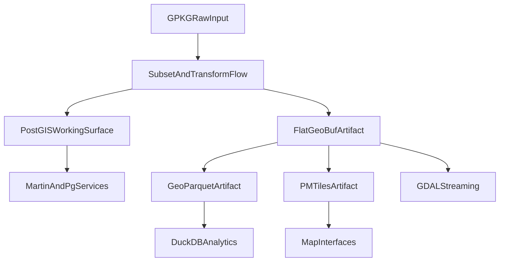

# Architecture

## Purpose

`us_parcels` is a geospatial monorepo that combines:

- backend data workflows and operational scripts
- backend services for ingestion and geospatial serving
- frontend interfaces for dashboard, map, and verification
- shared runtime configuration, docs, and validation

The repo is formalized around a dual-path architecture rather than a single storage winner.

## System Model

### raw input

- `LR_PARCEL_NATIONWIDE_FILE_US_2026_Q1.gpkg` is the immutable raw source input.
- It is not a production query surface.

### working surface

- PostGIS is the authoritative relational working surface for active subsets loaded into the stack.
- It powers normalization, search, ad hoc joins, and local tile/feature serving.

### published artifact surface

- Object storage artifacts are the authoritative published distribution layer.
- The canonical artifact trio is:
  - GeoParquet for analytics
  - FlatGeoBuf for geometry streaming
  - PMTiles for map delivery

## Division Of Labor

### PostGIS path

Use PostGIS for:

- active regional subsets
- normalization into `parcels.parcel`
- text search and indexed relational queries
- local vector tile and feature API development
- spatial joins against support layers loaded into the database

### cloud-native artifact path

Use published artifacts for:

- scalable object-storage distribution
- DuckDB range-query analytics against GeoParquet
- HTTP range-based geometry access via FlatGeoBuf
- zero-server tile delivery via PMTiles

## Control Surfaces

| Area | Authoritative files |
|------|---------------------|
| Runtime topology | `compose.yml` |
| Operator commands | `pixi.toml` |
| Convenience wrappers | `justfile` |
| Frontend/test package surface | `package.json` |
| Data pipeline entrypoint | `scripts/pipeline.ps1` |
| PostGIS schema | `scripts/postgis_schema.sql`, `scripts/etl_raw_to_parcel.sql` |
| Reverse proxy | `config/nginx.conf` |
| Tile server config | `config/martin.yaml` |
| Frontend interfaces | `index.html`, `map.html`, `ingest.html` |

## Runtime Components

| Component | Role | Notes |
|-----------|------|-------|
| `postgis` | relational working surface | subset loading, normalization, search, joins |
| `martin` | vector tile broker | serves normalized tables and selected PMTiles |
| `pg-tileserv` | direct MVT from PostGIS | useful for raw/SQL tile iteration |
| `pg-featureserv` | OGC Features API | bounded feature access from PostGIS |
| `minio` | local object storage | dev/prototype target for published artifacts |
| `web` | static frontend + proxy | single origin for UI and backend routes |
| `ingest-api` | local ingestion service | convenience service for extract/load workflows |
| `titiler` | optional raster service | enabled via profile |
| `gdal` | one-shot tooling container | used for ingestion/export commands |

## Service Boundaries

### web

- owner files: `compose.yml`, `config/nginx.conf`, `index.html`, `map.html`, `ingest.html`
- role: static frontend host and single-origin reverse proxy
- boundary: does not own data transformation or persistence

### martin

- owner files: `compose.yml`, `config/martin.yaml`
- role: tile broker over normalized PostGIS tables and selected PMTiles
- boundary: tile publishing config, not normalization logic

### pg_tileserv and pg_featureserv

- owner files: `compose.yml`
- role: direct service façades over PostGIS
- boundary: useful for local serving and debugging, not published artifact storage

### ingest-api

- owner files: `compose.yml`, `services/ingest-api/main.py`
- role: local extraction/load convenience service
- boundary: non-durable job state, intended for development and operator convenience rather than long-lived job orchestration

### minio

- owner files: `compose.yml`, `scripts/upload_to_minio.py`
- role: local published-artifact target
- boundary: storage and delivery, not transformation

## Config Ownership

| Config | Owner | Notes |
|--------|-------|-------|
| `compose.yml` | runtime topology | source of truth for services, ports, and profiles |
| `config/nginx.conf` | web boundary | source of truth for proxied routes |
| `config/martin.yaml` | tile service contract | source of truth for Martin-exposed layers |
| `config/styles/parcels.json` | primary frontend map style | authoritative style file |
| `config/parcels-style.json` | legacy style asset | retained for compatibility; do not treat as primary |

## Repository Conventions

This repo should be treated as a monorepo with clear domain boundaries.

### current layout

- `services/` contains service code
- `scripts/` contains data and ops entrypoints
- `config/` contains deploy/runtime config
- root HTML files provide current frontend interfaces

### target layout direction

The desired long-term shape is:

- `apps/` for frontend interfaces and Bun/TypeScript application code
- `services/` for backend services
- `scripts/` for operational entrypoints and one-shot workflows
- `config/` for runtime and infrastructure config
- `docs/` for normative documentation and ADRs

The current root-level frontend files remain supported during transition, but new frontend work should be organized with that monorepo direction in mind.

## Documentation Precedence

Documentation is authoritative in this order:

1. ADRs in `docs/ADR/`
2. `docs/ARCHITECTURE.md`
3. contract and runbook docs such as `docs/DATA_CONTRACT.md` and `docs/RUNBOOK.md`
4. `README.md` for onboarding and quick usage
5. exploratory or historical notes under `docs/chats/` as non-normative reference material

## Non-Goals

- loading the full national dataset into local PostGIS
- treating PostGIS as the long-term national warehouse
- treating ad hoc research notes as normative architecture
